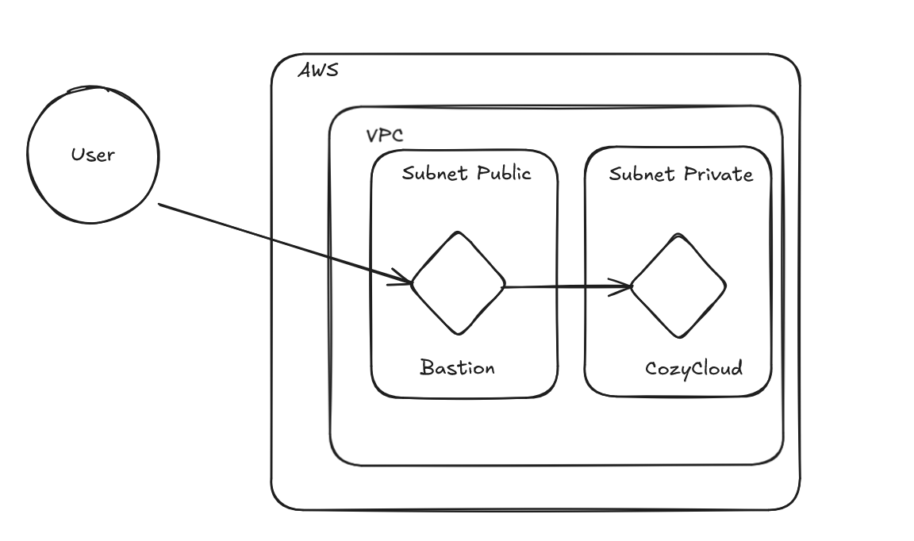

# Documentation pour la création d'une infrastructure AWS avec Terraform

## Objectif du projet

Ce projet consiste à créer une infrastructure AWS avec les caractéristiques suivantes :

1. Un Virtual Private Cloud (VPC).
2. Un subnet public et un subnet privé.
3. Une instance EC2 dans le subnet public (bastion).
4. Une instance EC2 dans le subnet privé.
5. L'accès à l'instance EC2 privée sera uniquement possible via l'instance bastion dans le subnet public.

Toutes les ressources devront être nommées avec le préfixe `CFT-`.

---

## Prérequis

1. **AWS CLI** installé et configuré avec les bonnes permissions.
2. **Terraform** installé.
3. Un fichier de configuration AWS avec des credentials valides.
4. Un accès au compte AWS avec les permissions nécessaires pour créer des ressources.

## Schéma attendu



---

## Étapes de mise en place avec Terraform

### 1. Initialisation de Terraform
Créez un fichier `main.tf` pour définir les ressources. Initialisez le projet avec :
```bash
terraform init
```

### 2. Création du VPC
Ajoutez une ressource VPC dans votre fichier Terraform :
```hcl
resource "aws_vpc" "CFT_vpc" {
  cidr_block       = "10.0.0.0/16"
  enable_dns_hostnames = true
  enable_dns_support   = true
  tags = {
    Name = "CFT-VPC"
  }
}
```

### 3. Création des subnets
#### Subnet public
```hcl
resource "aws_subnet" "CFT_public_subnet" {
  vpc_id                  = aws_vpc.CFT_vpc.id
  cidr_block              = "10.0.1.0/24"
  map_public_ip_on_launch = true
  availability_zone       = "us-east-1a" # Changez selon votre région
  tags = {
    Name = "CFT-Public-Subnet"
  }
}
```
#### Subnet privé
```hcl
resource "aws_subnet" "CFT_private_subnet" {
  vpc_id            = aws_vpc.CFT_vpc.id
  cidr_block        = "10.0.2.0/24"
  availability_zone = "us-east-1a" # Changez selon votre région
  tags = {
    Name = "CFT-Private-Subnet"
  }
}
```

### 4. Création de la gateway Internet et table de routage pour le subnet public
#### Gateway Internet
```hcl
resource "aws_internet_gateway" "CFT_igw" {
  vpc_id = aws_vpc.CFT_vpc.id
  tags = {
    Name = "CFT-Internet-Gateway"
  }
}
```
#### Table de routage
```hcl
resource "aws_route_table" "CFT_public_route_table" {
  vpc_id = aws_vpc.CFT_vpc.id
  tags = {
    Name = "CFT-Public-Route-Table"
  }
}

resource "aws_route" "CFT_public_route" {
  route_table_id         = aws_route_table.CFT_public_route_table.id
  destination_cidr_block = "0.0.0.0/0"
  gateway_id             = aws_internet_gateway.CFT_igw.id
}

resource "aws_route_table_association" "CFT_public_subnet_association" {
  subnet_id      = aws_subnet.CFT_public_subnet.id
  route_table_id = aws_route_table.CFT_public_route_table.id
}
```

### 5. Création des instances EC2
#### Instance bastion (subnet public)
```hcl
resource "aws_instance" "CFT_bastion" {
  ami           = "ami-12345678" # Remplacez par une AMI valide
  instance_type = "t2.micro"
  subnet_id     = aws_subnet.CFT_public_subnet.id
  tags = {
    Name = "CFT-Bastion"
  }
}
```

#### Instance privée (subnet privé)
```hcl
resource "aws_instance" "CFT_private_instance" {
  ami           = "ami-12345678" # Remplacez par une AMI valide
  instance_type = "t2.micro"
  subnet_id     = aws_subnet.CFT_private_subnet.id
  tags = {
    Name = "CFT-Private-Instance"
  }
}
```

---

## Configuration du bastion
Assurez-vous que le bastion dispose d'une clé SSH permettant de se connecter à l'instance privée. Ajoutez également une règle de sécurité pour autoriser uniquement l'accès SSH (port 22) depuis des adresses IP spécifiques.

Exemple de groupe de sécurité pour le bastion :
```hcl
resource "aws_security_group" "CFT_bastion_sg" {
  vpc_id = aws_vpc.CFT_vpc.id

  ingress {
    from_port   = 22
    to_port     = 22
    protocol    = "tcp"
    cidr_blocks = ["0.0.0.0/0"] # Limitez cette règle pour des raisons de sécurité
  }

  egress {
    from_port   = 0
    to_port     = 0
    protocol    = "-1"
    cidr_blocks = ["0.0.0.0/0"]
  }

  tags = {
    Name = "CFT-Bastion-SG"
  }
}
```

---

## Commandes Terraform
1. **Initialisation du projet** :
   ```bash
   terraform init
   ```

2. **Vérification du plan** :
   ```bash
   terraform plan
   ```

3. **Application des configurations** :
   ```bash
   terraform apply
   ```

4. **Nettoyage des ressources** (si nécessaire) :
   ```bash
   terraform destroy
   ```

---

## Notes de sécurité
- Limitez l'accès SSH uniquement à des adresses IP de confiance.
- Utilisez des clés SSH sécurisées.
- Assurez-vous que les instances ont des rôles IAM configurés si elles doivent interagir avec d'autres services AWS.

---
